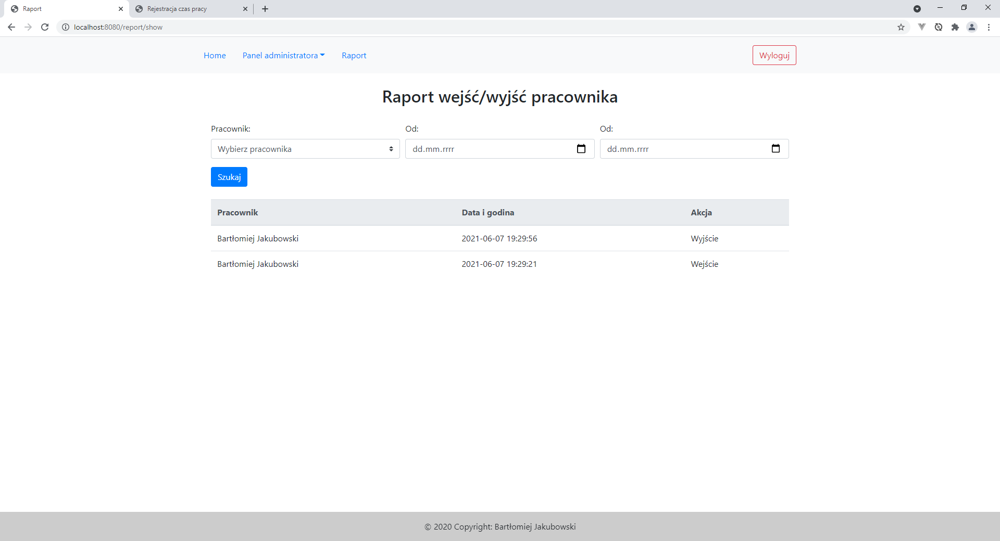

# Working Time Registration
> Project develop time registation  employee when come into and come out to company.

## Technologys
* SpringBoot
* Spring Security
* Hibernate
* Thymeleaf
* MySQL

## Application description
Employee coming to company scanning its unique card. Application on the desktop show actually state employee in company.Employee confirm data in the desktop. 
Application save data into database (actual time, employee info and event name). 
Employee with role user can login to application and show reports.
Employee with role admin can create new account employee, blocking card, change card number when is lose, create new user.

## Presentation of the application
#### Confirm event

#### Create new account

#### Edit account

#### Employee list

#### Report

